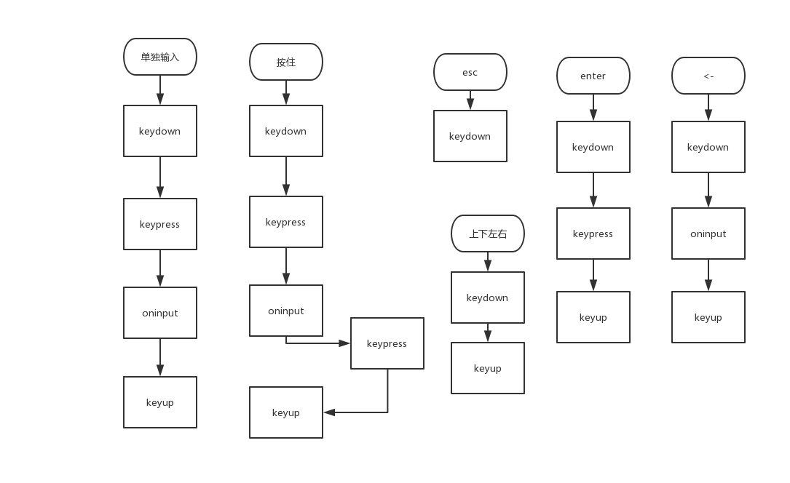

- 输入框监听常用事件input或change，keydown事件发生时input的value值还未改变，keypress在删除时不会发生。

- JS转换HTML转义符，将用户输入input的字符编码，替换为实体字符，显示在html中时再进行解码
> https://www.cnblogs.com/leejersey/p/4568092.html

- 判断按下的键位，使用EVENT.key或者EVENT.code
- 输入时按下esc，会触发全局事件，失去聚焦，需要input的监听中停止事件冒泡至全局ev.stopPropagation();
